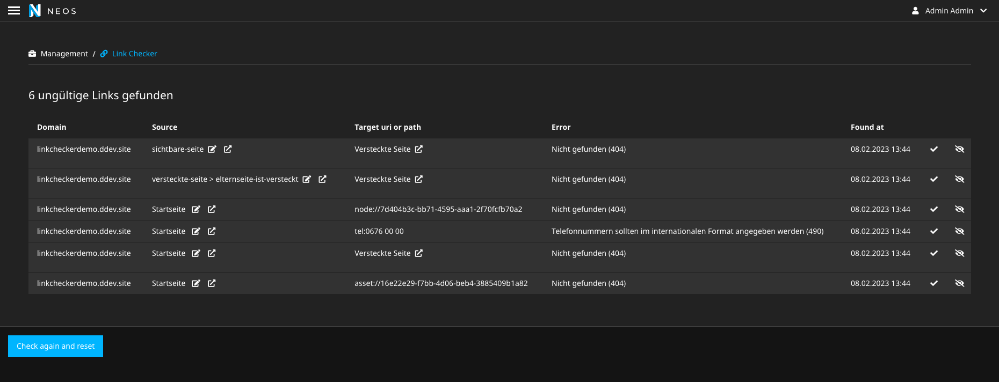

[](https://packagist.org/packages/codeq/linkchecker)
[](LICENSE)

# CodeQ.LinkChecker

## Keep your Neos website free of broken links with this easy-to-use link checker

CodeQ.LinkChecker makes sure all your links are working smoothly in Neos projects. It validates internal page and asset 
references, external links and phone numbers in node data, as well crawls all rendered pages to ensure that no hidden 
pages fall through the cracks!



The backend module allows you to mark errors as fixed and as to-be-ignored. Editing buttons directly open relevant pages
in the Neos inline editing to easily fix the issues.

The link checker has the following methods to find broken links:

 - The backend module can validate all internal page links `node://XXX` and assets `asset://XXX` in all node properties
   - Additionally, it validates phone numbers to be in international format (`+99 999999999`)
 - The command controller `./flow checklinks:crawl` will crawl all in the settings configured domains and pages and check the following:
   - Do all internal links `node://XXX` point to visible pages (not hidden, not hidden via visible before or visible after)
   - Are all phone numbers in international format (`+99 999999999`)
   - Do external links point to valid pages (http status code 2xx)
 - The command controller `./flow checklinks:crawlnodes` will only validate internal links, assets and phone numbers
 - The command controller `./flow checklinks:crawlexternallinks` will crawl the website and validate external links

## Installation

CodeQ.LinkChecker is available via packagist run `composer require codeq/linkchecker`.
We use semantic versioning so every breaking change will increase the major-version number.

## Usage

Configure the link checker sync in your settings, like this:

```yaml
CodeQ:
  LinkChecker:
    # how many concurrent requests should the command controller perform
    # If set too high, you will DDoS your server
    concurrency: 10
```

Make sure the domains are also added in the "Sites Management"!

Setup a cronjob e.g. daily to execute `./flow checklinks:crawl`

### Email reports

The link checker can also send an email report with a csv attachment with a list of all broken links.
To enable this, you need to configure the email service like this:

```yaml
CodeQ:
  LinkChecker:
    notifications:
      enabled: true
      subject: 'Link checker results'
      minimumStatusCode: 300
      mail:
        sender:
          default:
            name: 'Link Checker'
            address: 'no-reply@example.com'
        recipient:
          default:
            name: 'John Doe'
            address: 'recipient@example.com'
```

## Limitations and possible future Features:
 - Support additional languages
 - Use a job queue for crawling
 - Update the link checks after a page is published via a job queue
 - Check external links against malware oder security adviser lists
 - Find all occurrences of external links to internal pages
 - Check against deny list (e.g. list of competitors)
 - Check for broken links in other workspaces

## License

The GNU GENERAL PUBLIC LICENSE, please see [License File](LICENSE) for more information.

## Sponsors & Contribution

The development of this plugin was kindly sponsored by [Code Q](https://codeq.at/). 

The package is based on the `Unikka/LinkChecker` package, which does a great job at finding all broken external links. This package extends the features a lot, offers a new UI and introduces new dependencies.

We will gladly accept contributions. Please send us pull requests.
